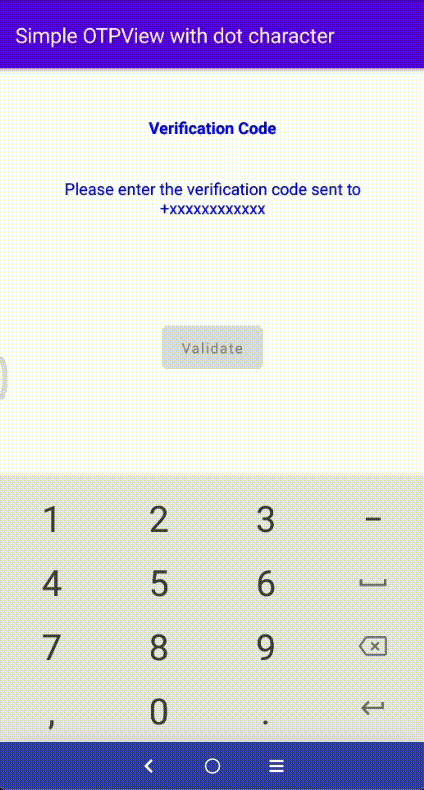
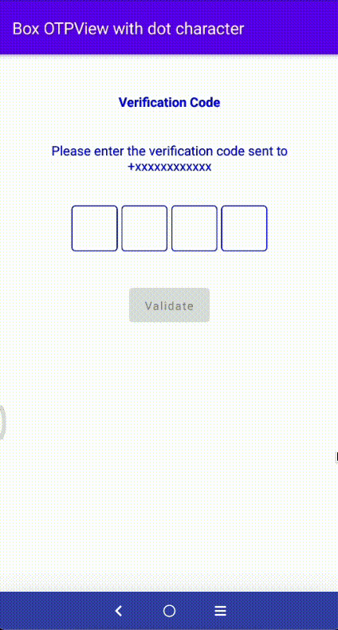
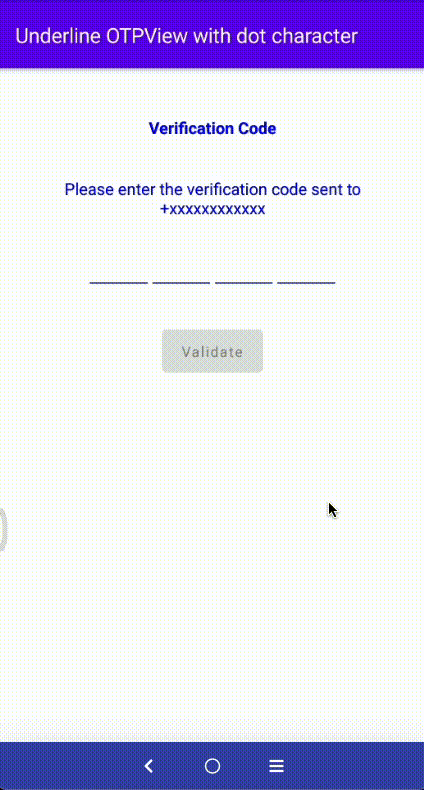
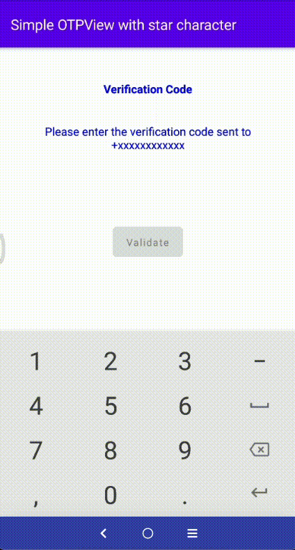
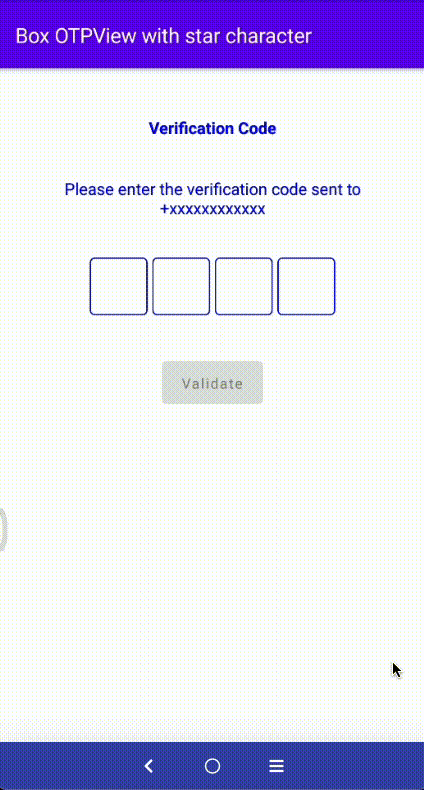
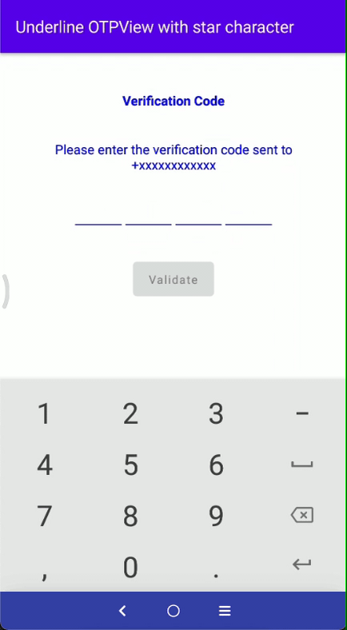

# SSComposeOTPPinView

[](https://developer.android.com/studio/)
[](https://kotlinlang.org)
[](https://www.android.com/)

A custom view to enter a code usually used in authentication.
Different type of OTPViews. Easy to use and configure your own view and character of OTP using all the attributes.

# Features
* Simple OTPView
* Box OTPView
* Underline OTPView
* We can manage our own OTPCount
* We can manage the OTP character color
* We can manage OTP character size
* We can manage the border color of OTPView as well
* We can enabled and disabled the visibility of OTP characters
* We can customize your OTP characters using attributes
* If we entered the incorrect length of OTP then button will not be clickable

# 🎬 Preview

| Simple OTPView with dot character | Box OTPView with dot character |
|--|--|
|  |  |

| Underline OTPView with dot character | Simple OTPView with star character |
|--|--|
 |  |

| Box OTPView with star character | Underline OTPView with star character |
|--|--|
 |  |

## How to use the library?
- Using Compose
  Just use the `OtpView` composable function where you need to display the view
```kotlin
 OtpView(
    otpText = otpValue,
    onOtpTextChange = {
    otpValue = it
    },
    type = OTP_VIEW_TYPE_NONE,
    password = true,
    containerSize = 48.dp,
    passwordChar = "•",
    keyboardOptions = KeyboardOptions(keyboardType = KeyboardType.Number),
    charColor = Color.White
)
```
Next in your code create `OtpView` composable function like below:
```kotlin
fun OtpView(
    modifier: Modifier = Modifier,
    otpText: String = "",
    charColor: Color = Color.Black,
    charBackground: Color = Color.Transparent,
    charSize: TextUnit = 16.sp,
    strokeColor: Color = Color.Black,
    containerSize: Dp = charSize.value.dp * 2,
    otpCount: Int = 4,
    type: Int = OTP_VIEW_TYPE_UNDERLINE,
    enabled: Boolean = true,
    password: Boolean = false,
    passwordChar: String = "",
    keyboardOptions: KeyboardOptions = KeyboardOptions(keyboardType = KeyboardType.Number),
    onOtpTextChange: (String) -> Unit
)
```

### All Attributes
------------------------

| Attribute | Description |
| --- | --- |
| `charColor` | To change otp character color. |
| `charSize` | Set custom character size. |
| `containerSize` | To change the size of otp character container. |
| `otpCount` | Set the custom range of otp characters. |
| `password` | Show/hide the otp characters. |
| `passwordChar` | Set the custom character for otp password. |
| `strokecolor` | Set the custom color to container border. |
| `type` | For customization we have created three types: </br>1. OTP_VIEW_TYPE_NONE </br>2. OTP_VIEW_TYPE_UNDERLINE </br>3. OTP_VIEW_TYPE_BOX |
| `keyboardOptions` | Set the custom keyboard which you need. |

## Official Documentations
- [Jetpack Compose](https://developer.android.com/jetpack/compose)
- [Jetpack Compose Pathways](https://developer.android.com/courses/pathways/compose)

## Find this samples useful? ❤️
Support it by joining __[stargazers](https://github.com/SimformSolutionsPvtLtd/SSComposeOTPPinView/stargazers)__ for this repository.⭐

## How to Contribute🤝

Whether you're helping us fix bugs, improve the docs, or a feature request, we'd love to have you! 💪
Check out our __[Contributing Guide](https://github.com/SimformSolutionsPvtLtd/SSComposeOTPPinView/blob/main/CONTRIBUTING.md)__ for ideas on contributing.

## Bugs and Feedback
For bugs, feature requests, and discussion please use [GitHub Issues](https://github.com/SimformSolutionsPvtLtd/SSComposeOTPPinView/issues).

## License

```
Copyright 2022 Simform Solutions

   Licensed under the Apache License, Version 2.0 (the "License");
   you may not use this file except in compliance with the License.
   You may obtain a copy of the License at

       http://www.apache.org/licenses/LICENSE-2.0

   Unless required by applicable law or agreed to in writing, software
   distributed under the License is distributed on an "AS IS" BASIS,
   WITHOUT WARRANTIES OR CONDITIONS OF ANY KIND, either express or implied.
   See the License for the specific language governing permissions and
   limitations under the License.
```